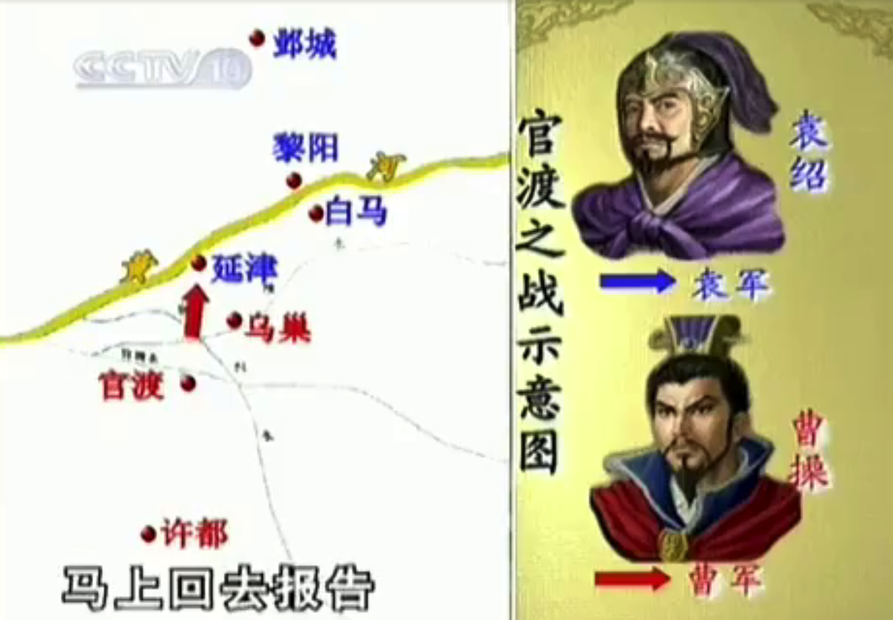

# 历史事件与历史人物

历史形象：历史学家主张的样子，比如三国志、史记的记载

文学形象：文学艺术作品的面目，电视剧、电影

民间形象：老百姓中的形象，每个人心中的形象

这三种形象差异很大，比如周瑜历史上气量非常大，少年英雄，24岁娶江东美女小乔，战场、官场、情场，场场得意怎么会嫉妒别人呢？

比如空城计，按当时司马懿和诸葛亮地理位置不可能发生，也不合逻辑，实际上是曹操和吕布发生的，火烧赤壁、借东风都是神话诸葛亮

每个人都有心中的历史形象，每个人都会站在不同的角度点评历史，那我们应该怎么看待历史？

如果要弄清历史形象：陈寿的三国志+裴松之的注释

三国演义当作兵书来看

三种形象各有各的道理

**总结：三种形象结合来看，听取不同角度的声音，才能更加立体的看待历史人物、历史事件**

# 曹操

## 青年时期

“治世之能臣，乱世之奸雄”

东汉末年宦官在政治上很有话语权，但是曹操是宦官收养的孩子的儿子，没有社会地位

家境好，门第不好，家教不好

青年时期的优点：文笔好、武艺好、好读书（尤好兵书）

**总结： 青年时期的曹操学习能力很强、喜欢读书值得学习**

## 能臣之路

曹操本想做能臣，但是当时的环境让他心灰意冷

做能臣的条件：

1. 看时世：治世才能做能臣，乱世不行
2. 要看政局：政局如果混乱不行
3. 看人主：皇帝是昏君还是明君
4. 看皇帝：皇帝的喜好

## 英雄之路

毛玠提出纲领性文件（正义旗帜/政治实力+实力/经济实力&战斗力），包含以下内容：

a.奉天子 政治策略 **在当时绝对正义的旗帜**

b.修耕植 经济策略

c.蓄军资 军事策略

曹操“敬纳其言”

---

荀彧提出三大纲领：

奉主上以从民望——大顺至尊

秉至公以服雄杰——大略至公

扶弘义以至英俊（招揽英雄）——大德至义

公元197年/建安2年正月 南征张绣，张秀不战投降，曹操得意忘形，随后张绣反叛，长子曹昂、爱将典韦、侄曹安民牺牲。

曹操成功的原因

**打败了检讨自己；打胜了感谢别人（团队的其他成员）**

建安4年11月 张绣听取贾诩意见，不选袁绍而投降曹操

贾诩意见：

a.曹操有政治优势，有理；

b.曹操比袁绍弱，雪中送炭比锦上添花好，有利；

c.曹操胸怀大志，以大局为重，有安全，个人恩怨（杀子之仇、爱将被杀）放在一边

## 官渡之战

袁绍当时的实力远大于曹操

1. 交锋阶段

   

   袁绍打白马，曹操佯装增援延津，使袁绍增援延津，后派关羽抄小路打白马，关羽斩颜良于马下。袁绍发现上当，中调虎离山之计。袁绍从延津出兵白马，曹操带着白马百姓沿着黄河往延津走，撞上了刘备和文丑，文丑被击败，刘备逃走。后曹操退军官渡。

   

2. 相持阶段

   双方在官渡南北扎营对峙。两军疲劳，曹操意欲撤军。荀彧言不退，贾诩言不退（智慧勇敢用人决断均超过袁绍，曹操顾虑太多想万无一失）。

   **战争风险极大，冷兵器时代谁也没法做到万无一失，战争的结果与主帅意志有较大相关。其实也不止是战争很多事情的是这样**

3. 转折阶段

   1）刘备开溜（政治上敏感，南下投刘表）；2）许攸叛逃（早期谋士掌握大量机密，欲望不能满足，计谋不能得到重用），献计右膝乌巢（袁粮所在）；3）张郃反水（有勇有谋），被郭图陷害。

   **失外援&丢智囊&折臂膀**

4. 决胜阶段

   曹操按贾诩计谋集中攻击袁绍，战争结束。

**在政治斗争、军事斗争中胜利的是洞悉人性、能琢磨对方心思的人** 

### 袁绍失败的原因

沮授给袁绍的建议：稳定发展，上报皇帝（平定了北方的公孙瓒），骚扰曹操（游击战、运动战、持久战）

沮授建议的正确性：

1）、把曹操放在不义的位置上，把他的政治优势转变为劣势——有理

2）、用运动战、游击战对付曹操，成本低、风险小、效益大——有利

3）、步步为营，见好就收，掌握合适时机消灭曹操——有节

战争是政治的延续

**政治上失利（打皇帝）；道义上失礼（恃强凌弱）；战略上失策（急功近利）；袁绍指挥失误（主帅的问题）**

袁绍的特点：缺少帅才、反应慢、用人失当  人才很多，都有毛病，领导不能知人善用、组织上失和（窝里斗）

**领导者需要了解每个人的优缺点，扬长避短、知人善用**

**团队中会上畅所欲言，会后紧密合作**

袁绍的成就：利用家族政治资源，讲家族事业推至顶峰，超过父辈祖辈。

**归根结底原因**：

为人失败、做人失败、性格的失败

即：内心分裂

表面上看起来风流倜傥，风度翩翩，和蔼可亲，宽以待人。实际上内心是**嫉妒别人的，猜忌别人的，狭隘的，刻薄的，受不了别人比他正确，比他聪明，比他风光**。